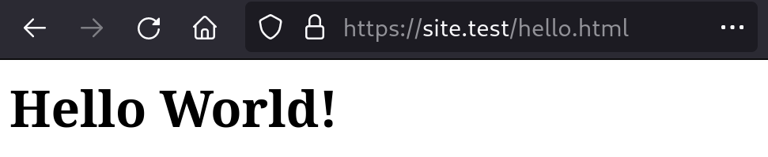

= Representations
:toc: left

Representations are a first-class (yet widely misunderstood) concept in HTTP.

Site fully supports HTTP features involving representations, such as *content
negotiation* when a resource has multiple representations.

== Introduction

[quote]
____
Considering that a resource could be anything, and that the uniform
interface provided by HTTP is similar to a window through which one
can observe and act upon such a thing only through the communication
of messages to some independent actor on the other side, an
abstraction is needed to represent ("take the place of") the current
or desired state of that thing in our communications.  That
abstraction is called a representation [REST].

For the purposes of HTTP, a "representation" is information that is
intended to reflect a past, current, or desired state of a given
resource, in a format that can be readily communicated via the
protocol, and that consists of a set of representation metadata and a
potentially unbounded stream of representation data.

-- https://datatracker.ietf.org/doc/html/rfc7231#section-3[Hypertext Transfer Protocol (HTTP/1.1): Semantics and Content (RFC 7231)]
____

Representations are the physical embodiments of a resource. In Site, we store
both resources and representations as documents in XTDB.

An individual resource is comprised of configuration and time-varying state,
which maps directly onto an individual XTDB entity. When a resource's state changes, the new state is stored as a new document of the XTDB entity, both are identified by the URI.

A representation is comprised of some metadata and a payload, or the
configuration data required to generate one. A representation is also a separate
resource, identified with its own URI.

== Adding an HTML variant of 'Hello World'

In <<hello-world-example>> we created a resource that responded to a GET request with a
response body of 'Hello World!'.

The 'Hello World!' string reflects the state of a resource in a form that can be
"readily communicated", in this case, as a plain-text string.

<<hello-world-html-example>> creates an alternative *variant* which is itself a
separate resource, related to the original resource through the
`juxt.site.alpha/variant-of` document attribute.

[[hello-world-html-example]]
.Hello World in HTML
====
Let's add a variant to the `https://site.test/hello` resource that will generate a
response body in HTML.

[source,clojure]
----
include::../../test/juxt/book.clj[tag=create-hello-world-html-representation!,indent=0]
----
<1> The variant is itself a resoure, with its own URI.
<2> The content-type, and potentially other attributes making up the *representation metadata*, is included in the document
<3> The representation payload, as a string. The string must be encoded in the charset indicated by the content-type. Alternatively, use `:juxt.http.alpha/body` to provide a byte-array.
<4> The `:juxt.site.alpha/variant-of` signifies that this resource is a representation of another resource.

[IMPORTANT]
--
Developer note: Don't do this just now, since we should allow `variant-of` to
mean _additional_ variant of, but right now it overrides the representation in
`/hello`
--

We can now test with curl

----
curl -i https://site.test/hello.html
----

Or, indeed, with a browser.

====
